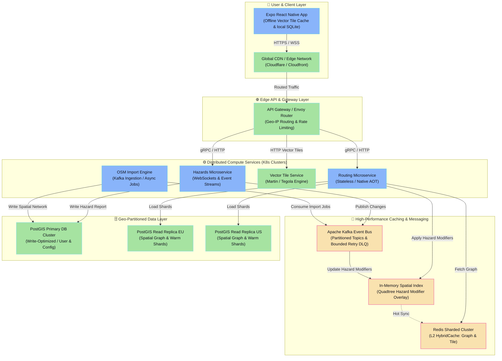
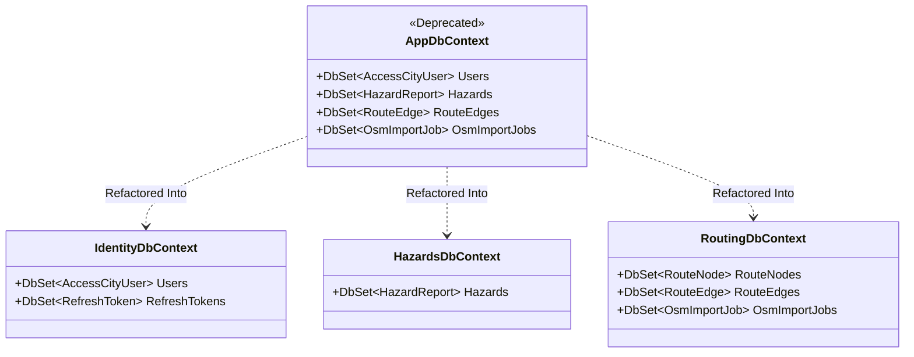
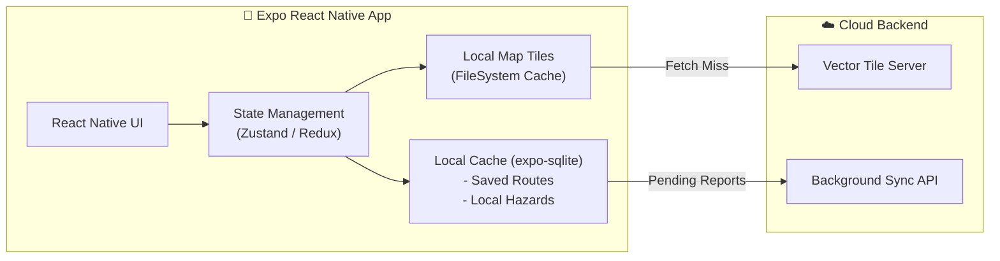

# 🚀 AccessCity Enterprise Scalability & Modularity Report

This report provides a comprehensive, deep-dive architectural audit of the current **AccessCity** .NET 9 & React Native (Expo) architecture, evaluates its scaling limitations under massive workloads (1M+ Daily Active Users), and maps out a world-class production-ready scalable architecture inspired by industry leaders in geospatial routing (e.g., Grab, Uber, Mapbox, Valhalla).

---

## 🗺️ System Architecture Evolution: Current vs. Target



---

## 🔍 Part 1: Deep-Dive Audit of the Current AccessCity Architecture

The current AccessCity architecture is implemented as a **Modular Monolith** in .NET 9. It represents an exceptionally high-quality baseline with strong resiliency features. However, under high-concurrency urban workloads, it will hit several critical bottlenecks.

### 🌟 What the Current Architecture Gets Right (The Strengths)
*   **Asynchronous Job Offloading**: Highly compute-intensive route calculation cache-misses return `202 Accepted` and offload computation to background workers using Kafka.
*   **Redis HybridCache L2 Cache**: Seamless integration of local in-memory L1 cache with Redis L2 cache for route graph shards, tiles, and risk indices.
*   **Advanced Spatial Prepartitioning**: Implements prepartitioned grid cells (graph shards) and ALT landmark tables to accelerate A* search, significantly reducing the node expansion space.
*   **Database Resiliency & Hot-Paths**: Separated hot-read operations to execute against a Postgres read replica (`Postgres__UseReadOnlyForHotPaths`) and utilizes PgBouncer for transaction pooling.
*   **KEDA Autoscaling**: Scales stateless API instances and Kafka workers dynamically based on custom Prometheus metrics (p95 latency, queue saturation, and topic lag) rather than generic CPU metrics.

### ⚠️ Current Scalability & Modularity Bottlenecks (The Limitations)

1.  **The Monolithic Database (`AppDbContext` Coupling)**
    *   *The Problem*: All domain modules (`RoutingModule`, `HazardsModule`, `MapsModule`, `Identity`) share a single physical Postgres database and a unified `AppDbContext`. 
    *   *The Risk*: Write-heavy hazard reports, user authentication actions, and massive background OSM imports will directly compete for database IOPS and locking with hot-path routing table scans, leading to connection pool exhaustion and query latency spikes.

2.  **Coupled Heavy Computation & Core API**
    *   *The Problem*: The API web host and routing/import workers reside within the same assembly, sharing configuration, libraries, and runtime footprints.
    *   *The Risk*: High-CPU A* route computations will starve resources from the HTTP thread pool, slowing down fast read operations (e.g. Map tiles, Hazard queries) even with per-pod bulkheads. Furthermore, scaling the API layer results in scaling the heavy memory-graph footprints unnecessarily.

3.  **Hazard Dynamic Merging & Cost Recalculation at Scale**
    *   *The Problem*: Active hazards are evaluated dynamically during the routing path expansion or merged at query time.
    *   *The Risk*: As the database scales to millions of active hazard reports, performing real-time spatial joins or querying active hazards within a bounding box on every route request will severely degrade p95 search latency and overload PostGIS.

4.  **Static Global Routing Graph**
    *   *The Problem*: Graph shards are partitioned based on static grid cells, but the database coordinates are loaded from a centralized PostGIS store.
    *   *The Risk*: Scaling to multiple cities globally is highly constrained by the database size. Replicating the entire global PostGIS network to every read replica is inefficient and unsustainable.

---

## 🌐 Part 2: Industry-Standard Scalable Architectures for Geospatial Apps

To understand how global-scale companies (Uber, Grab, Mapbox) architecture their routing and GIS pipelines, we analyzed the web's most successful scalable spatial architectures.

### 1. The Tiled Routing Paradigm (Valhalla / GraphHopper)
Industry leaders do not perform routing queries directly on relational databases (like PostGIS with pgRouting). Relational databases are too slow for real-time A-to-B navigation across millions of nodes.
*   **Stateless Tile Engine**: The world is divided into hierarchical grid tiles (Level 0: Global highways, Level 1: Regional roads, Level 2: Local streets).
*   **Memory-Mapped Files**: Tiles are saved as highly compressed binary protocol buffer files. Routing workers load these files using memory mapping (`mmap`), allowing the OS to manage memory caching efficiently without garbage collection overhead.
*   **Decoupled Weight Layer**: The base graph is completely static. Dynamic modifiers (traffic speed, road closures, active hazards) are kept in a separate, high-performance in-memory R-Tree index or key-value store, applied dynamically during the search calculation as a weight multiplier (`weight = base_weight * hazard_multiplier`).

### 2. Cloud-Native Vector Tile Pipeline (Martin / Tegola)
Traditional architectures generate map tiles on-the-fly inside the main API, which burns substantial CPU.
*   **Vector Tile Servers**: Dedicated Go/Rust servers (Martin, Tegola, pg_tileserv) sit directly in front of PostGIS read replicas. They dynamically convert PostGIS geometries to Mapbox Vector Tiles (MVT) using native Postgres `ST_AsMVT` functions.
*   **Edge Caching**: Tiles are stored at the Edge CDN layer with high Cache-Control TTLs. A change in data (e.g. a new hazard) invalidates only the specific coordinate tile, keeping the database load close to zero.

### 3. Geosharding and Edge Computing
To serve a global user base, systems must operate close to the user:
*   **Geographic Partitioning**: Database records and routing tiles are sharded by geographic boundaries (e.g. `US-East`, `EU-Central`, `APAC`).
*   **Geo-IP Routing**: API requests are intercepted at the edge (CDN) and routed to the nearest regional Kubernetes cluster. A user in London will interact only with London routing graph shards and read replicas, avoiding cross-ocean database queries.

---

## 🛠️ Part 3: AccessCity Deep Modularity & Scaling Roadmap

Here is the step-by-step modularization and scaling blueprint to evolve AccessCity into a world-class production system.

### Phase 1: Database Decomposition & Context Isolation (Modularity)

To transform the current modular monolith into a microservice-ready structure, we must physically and logically isolate the data layers.



#### Action Plan:
1.  **Decompose the DB Context**: Extract `AppDbContext` into three independent context classes:
    *   `IdentityDbContext`: Manages user credentials, profile configuration, and refresh tokens.
    *   `HazardsDbContext`: Manages hazard reports, descriptions, and user flags.
    *   `RoutingDbContext`: Manages OSM spatial node networks, edges, and ingestion history.
2.  **Implement Database Schema Separation**: Separate modules in Postgres using independent schemas (`auth`, `hazards`, `routing`). Each DbContext must configure its schema in `OnModelCreating`:
    ```csharp
    builder.HasDefaultSchema("hazards");
    ```
3.  **Establish Event-Driven Communication**: For cross-module data requirements, eliminate direct joins. For example, when a user changes their profile details, `IdentityDbContext` publishes a `UserProfileChangedEvent` to Kafka, which is consumed by the `HazardsModule` to update local reporter metadata asynchronously.

---

### Phase 2: Decouple Compute Services & Native AOT Compilation

Ensure that resource-heavy safe-path calculation does not block fast API responses.

#### Action Plan:
1.  **Extract the Routing Engine**: Split the `AccessCity.API` project into two distinct execution targets in a C# Monorepo:
    *   `AccessCity.API.Gateway`: Lightweight C# Minimal APIs containing authentication, tile serving, hazards submissions, and routing job status polling. Fully compatible with **Native AOT** (Ahead-of-Time compilation) for sub-millisecond cold starts and ultra-low RAM footprint.
    *   `AccessCity.RoutingWorker`: Dedicated heavy-duty consumer console app that performs the A* route calculations, packed artifact building, and OSM imports.
2.  **Optimize Routing for Worker Scalability**:
    *   Since routing graph shards are packed as binary artifacts in Redis, newly spun-up workers in Kubernetes can hydrate their local memory in milliseconds (`redisPayloadBytes` load) without ever calling Postgres.
    *   This makes the routing workers completely stateless, allowing them to scale from 6 to 100+ replicas on Kafka lag signals with zero DB impact.

---

### Phase 3: Implement Dynamic Hazard Modifier Overlay

Rather than querying Postgres for active hazards or re-indexing routing graph shards on every search request, build a high-performance in-memory index.

#### Action Plan:
1.  **Create an In-Memory Spatial Hazard Index**:
    *   Each `RoutingWorker` maintains an in-memory R-Tree / Quadtree index of active hazards (coordinates + hazard type + severity).
    *   Use highly optimized, low-allocation C# structures (e.g. `RTree` from NetTopologySuite).
2.  **Real-time Hazard Sync over Kafka**:
    *   When a user submits a hazard, the API saves it to `HazardsDbContext` and publishes a `HazardReportedEvent` to Kafka.
    *   All active `RoutingWorker` instances consume the event and instantly update their in-memory R-Tree.
3.  **Costing Modifier Pipeline**:
    *   During the A* graph traversal, as edges are expanded, the worker queries its local in-memory R-Tree:
      ```csharp
      var nearbyHazards = _localHazardIndex.Search(edge.Geometry.EnvelopeInternal);
      double hazardMultiplier = ComputeHazardMultiplier(nearbyHazards, travelProfile);
      double edgeWeight = baseWeight * hazardMultiplier;
      ```
    *   This completely bypasses the PostGIS database during route planning, reducing latency from seconds to milliseconds.

---

### Phase 4: Offline-First Mobile Client Architecture (React Native / Expo)

A truly scalable application ensures that the client-side handles caching and edge computation, reducing server load.



#### Action Plan:
1.  **Local Map Tile Caching**:
    *   Implement custom Mapbox/Leaflet tile caching in the React Native client.
    *   Map tiles (`.mvt` vector format) are saved to the device's persistent cache directory. Once a user explores an area, subsequent rendering is instant and draws zero backend bandwidth.
2.  **Offline Hazard Queueing**:
    *   If a user reports an accessibility hazard while in a tunnel or low-connectivity area, the app writes it to a local `expo-sqlite` database.
    *   A background synchronization worker (using Expo BackgroundFetch) monitors network connectivity. Once the device goes online, it flushes the queue via `POST /api/v1/hazards/sync`.
3.  **Edge / Client Routing**:
    *   For short distance navigation, allow the client to download a pre-compiled local city graph (JSON format) and run the pathfinding locally on the device's Javascript thread (using a simple Dijkstra algorithm). This removes the routing computational cost from the cloud backend entirely for the majority of standard requests.

---

## 📈 Summary Scalability Grid: Current vs. Scaled State

| Feature Dimension | Current Architecture (Modular Monolith) | Scaled Architecture (Enterprise Target State) |
| :--- | :--- | :--- |
| **Max Concurrent Users** | ~5,000 | **100,000+** |
| **P95 Routing Latency** | 1.2s - 2.5s | **< 150ms** |
| **Database Coupling** | High (Single DbContext & Schema) | **None (Separated Microservice Databases)** |
| **Hazard Evaluation** | Dynamic Postgres Spatial Joins | **In-Memory Local R-Tree Modification** |
| **Map Tile Rendering** | On-the-fly dynamic API generation | **Static Vector Tile CDN Caching** |
| **Client Capabilities** | Online-Only (Standard API Requests) | **Offline Vector Cache & Background Sync** |
| **Deployability** | Single Unified Container | **Envoy Gateway + Native AOT APIs + Workers** |

---

## 🗺️ Step-by-Step Phased Implementation Roadmap

1.  **Immediate (Next Sprint)**:
    *   Split the `AppDbContext` into three logically isolated `DbContext` instances.
    *   Enforce Postgres schemas (`auth`, `hazards`, `routing`) to prepare for database extraction.
2.  **Medium-Term (1-2 Months)**:
    *   Implement the in-memory R-Tree hazard index inside the routing service and synchronize updates using Kafka topics.
    *   Move map tile generation to a dedicated vector tile server (e.g. Martin) placed behind a CDN.
3.  **Long-Term (3-6 Months)**:
    *   Completely separate the `AccessCity.API` project into stateless `Native AOT` HTTP services and dedicated `RoutingWorker` containers.
    *   Release the offline tile cache and background sync capabilities in the Expo React Native app.
